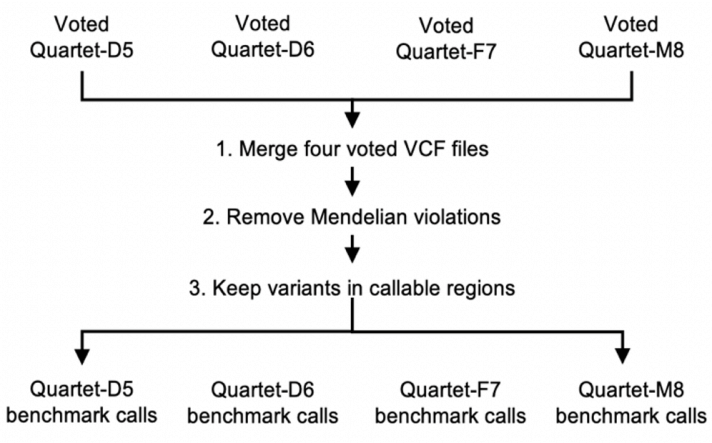

### How to download the reference datasets?

#### Download with Browser
| Name                        | Link                                                                                                        |
| --------------------------- | ----------------------------------------------------------------------------------------------------------- |
| LCL5.high.confidence.calls.vcf | [Download](http://reference-datasets.oss-accelerate.aliyuncs.com/v20210909/DNA/LCL5.high.confidence.calls.vcf) |
| LCL6.high.confidence.calls.vcf | [Download](http://reference-datasets.oss-accelerate.aliyuncs.com/v20210909/DNA/LCL6.high.confidence.calls.vcf) |
| LCL7.high.confidence.calls.vcf | [Download](http://reference-datasets.oss-accelerate.aliyuncs.com/v20210909/DNA/LCL7.high.confidence.calls.vcf) |
| LCL8.high.confidence.calls.vcf | [Download](http://reference-datasets.oss-accelerate.aliyuncs.com/v20210909/DNA/LCL8.high.confidence.calls.vcf) |
| Quartet.high.confidence.region.v202103.bed | [Download](http://reference-datasets.oss-accelerate.aliyuncs.com/v20210909/DNA/Quartet.high.confidence.region.v202103.bed) |
| contig.txt | [Download](http://reference-datasets.oss-accelerate.aliyuncs.com/v20210909/DNA/contig.txt) |

#### Download with wget

```text
http://reference-datasets.oss-accelerate.aliyuncs.com/v20210909/DNA/LCL5.high.confidence.calls.vcf
http://reference-datasets.oss-accelerate.aliyuncs.com/v20210909/DNA/LCL6.high.confidence.calls.vcf
http://reference-datasets.oss-accelerate.aliyuncs.com/v20210909/DNA/LCL7.high.confidence.calls.vcf
http://reference-datasets.oss-accelerate.aliyuncs.com/v20210909/DNA/LCL8.high.confidence.calls.vcf
http://reference-datasets.oss-accelerate.aliyuncs.com/v20210909/DNA/Quartet.high.confidence.region.v202103.bed
http://reference-datasets.oss-accelerate.aliyuncs.com/v20210909/DNA/contig.txt
```

### Description
The Quartet DNA reference datasets are provided as a variant call file (vcf) that contains the high-confidence SNVs, small indels (less than 50 bp), and structural variants (insertions and deletion over than 50 bp), as well as a tab-delimited "bed" file that describes the high-confidence bed regions, using methods described in the Quartet DNA manuscript. The v20210909 of DNA reference datasets covers approximately 87.8% of the GRCh38 assembly [GDC Reference Files](https://gdc.cancer.gov/about-data/gdc-data-processing/gdc-reference-files). As sequencing technologies and analysis methods improve, the reference datasets will be updated periodically. 



<p style="text-align: center;">Figure 1 Workflow for constructing Quartet DNA reference datasets.</p>

### Construction of reference datasets
To establish small variant benchmark calls, we selected variants concordant in multiple call sets and Mendelian consistency in the Quartet family. First, we kept variants supported by most call sets. Small-variant genotypes were retained, if supported by (1) at least 2/3 replicates in one batch, (2) at least 4/5 batches by PCR library preparation and 3/4 batches by PCR-free, and (3) both PCR and PCR-free library preparation methods. More than 6 million variants were called across 27 gVCF call sets for each Quartet sample, and 1.4 million irreproducible variants were removed by this filtering process.

We then checked Mendelian inheritance status within the Quartet family of father-mother-twins for those remained reproducible variants. The number of Mendelian violations was much higher than what would be expected due to de novo mutations or somatic mutations arose from cell culture, therefore Mendelian violations are assumed to be probably artifacts. We filtered 0.45 million Mendelian violated small variants and kept 4.2 million consensus small variants for each Quartet DNA reference material, which were shared by the identical twins and followed Mendelian inheritance laws with parents.

Small variant benchmark calls were validated by PacBio circular consensus sequencing (CCS) reads and the Axiom Precision Medicine Research Array (PMRA). False positives confirmed by Integrative Genomics Viewer (IGV) were removed.

We used the same strategy to establish structural variant benchmark calls. Since the detection of duplications (DUPs), inversions (INVs) and breakends (BNDs) varied between different pipelines, we only considered insertions (INSs) and deletions (DELs) into structural variant benchmark calls. To select reproducible structural variants, we first merged clustered variants of the same type in a single call set, for a large structural variant may be incorrectly called as multiple adjacent small structural variants. This left ~90,000 structural variants in 30 call sets for each Quartet sample. Reproducible structural variants were selected if supported by at least six pipelines of one platform or two sequencing platforms by any pipeline. Then, large structural variants (over 10Mb) and structural variants located in centromeres, peri-centromere, and gaps regions were excluded.

We merged the four Quartet integrated structural variants catalogs and re-genotyped them in a pedigree by three genotypers (Sniffles, SVjedi, LRcaller) from two sequencing platforms (PacBio Sequel and ONT). A total of 23,891 structural variants were retained, which were supported by at least 6/10 re-genotyped call sets. Among them, 4760 structural variants were Mendelian violations and removed. Finally, about 15,000 structural variants were kept as benchmark calls for each Quartet DNA reference material. We observed expected peaks for INSs and DELs near 300bp, 2.1kb and 6kb corresponding to Alu elements, SVA elements and full-length LINE1 elements respectively, consistent with published studies. Structural variant benchmark calls were then validated by short-read, linked-read and optical and long-read assembly-based call sets.

Benchmark regions of structural variants were established from high-depth sequencing PacBio Sequel assemblies. The benchmark regions of the twin's cover ~2.62Gb of the reference genome (GRCh38; chr1-22), which contain 12,705 structural variants (7008 INSs and 5697 DELs). The benchmark regions of F7 cover ~2.59 Gb and 12,830 structural variants (6785 INSs and 6045 DELs). The benchmark regions of M8 cover ~2.59Gb and 12,634 structural variants (6568 INSs and 6066 DELs).
