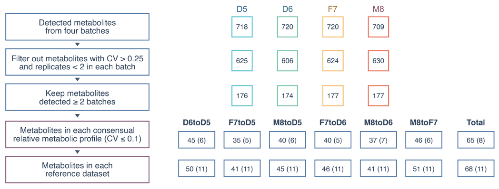

### How to download the reference datasets? 

#### Download with Browser
| Name                        | Link                                                                                                        |
| --------------------------- | ----------------------------------------------------------------------------------------------------------- |
| RefDT_D6toD5.csv | [Download](http://reference-datasets.oss-accelerate.aliyuncs.com/v20210909/Metabolite/RefDT_D6toD5.csv) |
| RefDT_F7toD5.csv | [Download](http://reference-datasets.oss-accelerate.aliyuncs.com/v20210909/Metabolite/RefDT_F7toD5.csv) |
| RefDT_F7toD6.csv | [Download](http://reference-datasets.oss-accelerate.aliyuncs.com/v20210909/Metabolite/RefDT_F7toD6.csv) |
| RefDT_M8toD5.csv | [Download](http://reference-datasets.oss-accelerate.aliyuncs.com/v20210909/Metabolite/RefDT_M8toD5.csv) |
| RefDT_M8toD6.csv | [Download](http://reference-datasets.oss-accelerate.aliyuncs.com/v20210909/Metabolite/RefDT_M8toD6.csv) |
| RefDT_M8toF7.csv | [Download](http://reference-datasets.oss-accelerate.aliyuncs.com/v20210909/Metabolite/RefDT_M8toF7.csv) |

#### Download with wget

```text
http://reference-datasets.oss-accelerate.aliyuncs.com/v20210909/Metabolite/RefDT_D6toD5.csv
http://reference-datasets.oss-accelerate.aliyuncs.com/v20210909/Metabolite/RefDT_F7toD5.csv
http://reference-datasets.oss-accelerate.aliyuncs.com/v20210909/Metabolite/RefDT_F7toD6.csv
http://reference-datasets.oss-accelerate.aliyuncs.com/v20210909/Metabolite/RefDT_M8toD5.csv
http://reference-datasets.oss-accelerate.aliyuncs.com/v20210909/Metabolite/RefDT_M8toD6.csv
http://reference-datasets.oss-accelerate.aliyuncs.com/v20210909/Metabolite/RefDT_M8toF7.csv
```


### Description
A reference dataset was built with the following steps in the workflow. The preliminary expression profile with 6,319 features (proteins mapped to gene symbols) and 72 replicates was merged from six batches of data (DDA-APT, DDA-FDU, DDA-NVG, DIA-APT, DIA-BGI, DIA-FDU), which were generated by two technologies (DDA and DIA) using six units of Quartet Protein Reference Materials. At absolute expression levels, we filtered out features quantitated with CV greater than 20% and we recognized thet features detected in at least four batches are stably detectable. At relative expression levels, features of six sample pairs with p.adj lower than 0.05 in at least four batches were kept in the dataset. Finally, Differencially Expressed Proteins (DEPs) were identified by medians of p.adj values (p.med) among different batches and the corresponded log2FC values.



<p style="text-align: center;">Figure 1. Flowchart of building a reference dataset.</p>