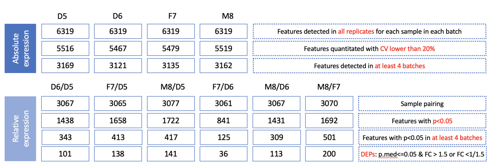

### How to download the reference datasets? 

#### Download with Browser
| Name                        | Link                                                                                                        |
| --------------------------- | ----------------------------------------------------------------------------------------------------------- |
| ref_relative_dt.csv | <a href="http://reference-datasets.oss-accelerate.aliyuncs.com/v20210909/Protein/ref_relative_dt.csv" target="_blank">Download</a> |
| ref_relative_filtered_D6_D5.csv | <a href="http://reference-datasets.oss-accelerate.aliyuncs.com/v20210909/Protein/ref_relative_filtered_D6_D5.csv" target="_blank">Download</a> |
| ref_relative_filtered_F7_D5.csv | <a href="http://reference-datasets.oss-accelerate.aliyuncs.com/v20210909/Protein/ref_relative_filtered_F7_D5.csv" target="_blank">Download</a> |
| ref_relative_filtered_F7_D6.csv | <a href="http://reference-datasets.oss-accelerate.aliyuncs.com/v20210909/Protein/ref_relative_filtered_F7_D6.csv" target="_blank">Download</a> |
| ref_relative_filtered_M8_D5.csv | <a href="http://reference-datasets.oss-accelerate.aliyuncs.com/v20210909/Protein/ref_relative_filtered_M8_D5.csv" target="_blank">Download</a> |
| ref_relative_filtered_M8_D6.csv | <a href="http://reference-datasets.oss-accelerate.aliyuncs.com/v20210909/Protein/ref_relative_filtered_M8_D6.csv" target="_blank">Download</a> |
| ref_relative_filtered_M8_F7.csv | <a href="http://reference-datasets.oss-accelerate.aliyuncs.com/v20210909/Protein/ref_relative_filtered_M8_F7.csv" target="_blank">Download</a> |

#### Download with wget

```text
http://reference-datasets.oss-accelerate.aliyuncs.com/v20210909/Protein/ref_relative_dt.csv
http://reference-datasets.oss-accelerate.aliyuncs.com/v20210909/Protein/ref_relative_filtered_D6_D5.csv
http://reference-datasets.oss-accelerate.aliyuncs.com/v20210909/Protein/ref_relative_filtered_F7_D5.csv
http://reference-datasets.oss-accelerate.aliyuncs.com/v20210909/Protein/ref_relative_filtered_F7_D6.csv
http://reference-datasets.oss-accelerate.aliyuncs.com/v20210909/Protein/ref_relative_filtered_M8_D5.csv
http://reference-datasets.oss-accelerate.aliyuncs.com/v20210909/Protein/ref_relative_filtered_M8_D6.csv
http://reference-datasets.oss-accelerate.aliyuncs.com/v20210909/Protein/ref_relative_filtered_M8_F7.csv
```


### Description
A reference dataset was built with the following steps in the workflow. We first filter out low-quality metabolites with CV greater than 25% and the number of replicates less two in each batch. Subsequently, only metabolites that were jointly detected in at least two datasets were retained, and the ratio results of the six sample combinations in each batch of these metabolites were calculated. Taking the total CV <10% as the criterion for consensual results between datasets, we searched for metabolites agreed by at least 2 datasets in each sample combination and took the average ratio of the largest agreed datasets in these metabolites as the consensual relative reference dataset. With adding nominal ratios of spike-ins of sample pairs, which is 1, we constructed 6 relative reference datasets containing only 68 metabolites in total.



<p style="text-align: center;">Figure 1. Flowchart of buiding a reference dataset.</p>
