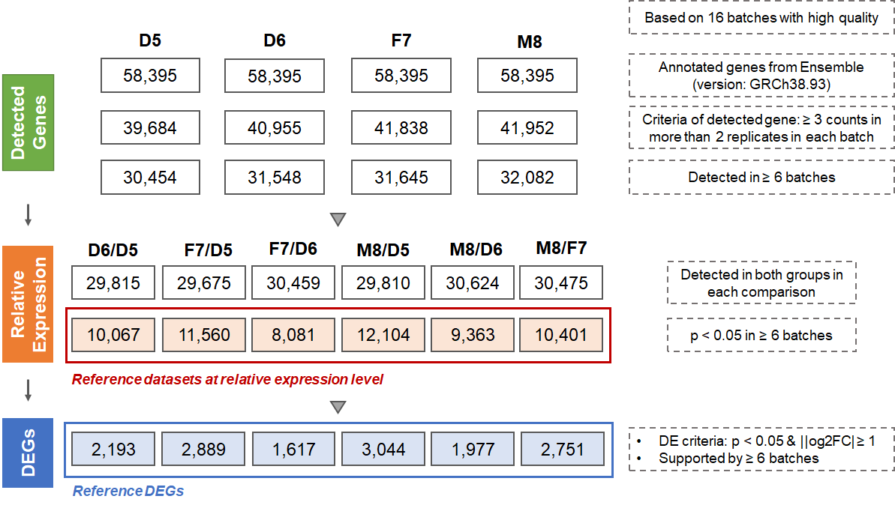

[](#download-reference-datasets)

### Description
Based on high-quality of multi-lab RNA-seq libraries, we have reached consensuses on the characterization of gene expression at relative level as reference datasets, and established performance metrics for proficiency test. 
       
We used expression profiles from 16 hiqh-quality RNA-seq batches to construct reference datasets (Figure 1). Of the 58,395 genes annotated in GRCh38.93, 10,067 (17.2%) for D6/D5, 11,560 (19.8 %) for F7/D5, 8,081 (13.8%) for F7/D6, 12,104 (20.7%) for M8/D5, 9,363 (16.0%) for M8/D6, and 10,401 (17.8%) for M8/F7 were determined as reference datasets. Moreover, the numbers of reference DEGs ranged from 1,617 to 3,044 for the six pairs of sample groups. 



<p style="text-align: center;">Figure 1 Workflow for constructing Quartet RNA reference datasets.</p>

### Construction of reference datasets
We constructed the reference datasets of relative expression in three steps: identifying detectable genes, calculating relative expression, and selecting differentially expressed genes (DEGs), based on high-quality batches identified using intra-batch SNRs. Reference datasets at absolute expression level were not calculated owing to the incomparability across different batches.
      
First, a gene was considered expressed in a sample in each batch if more than three reads were mapped to it in at least two of the three replicates. We found that most genes were consistently detected or undetected across most batches, indicating a high level of concordance in qualitative detection of gene expression. If a gene was detected in at least six of high-quality batches in a sample, it was considered expressed in that sample. 

Secondly, relative expression data (fold changes) were calculated for a total of six pairs of sample-to-sample comparisons (D6/D5, F7/D5, M8/D5, F7/D6, M8/D6, and M8/F7) among the Quartet reference materials. In order to improve the reliability of the reference values, genes that were satisfied with thresholds of p < 0.05 and detectable across the two samples in each sample pair were used. 
      
Finally, a gene was considered differentially expressed in a batch between two samples if p < 0.05 and fold change ≥ 2 or ≤ 0.5 using limma package51 for up- or down-regulation, respectively. A small number of genes were consistently detected as either up- or down-regulated across the high-quality batches. A gene was defined as a reference DEG if it was concordantly discovered as an up- or down-regulated gene in more than five of the high-quality high-quality batches. 

### Reference based performance metrics
Relative correlation with reference datasets was calculate based on the Pearson correlation coefficient between the relative expression levels of a dataset for a given pair of groups and the corresponding reference fold-change values, or "Relative correlation with reference datasets" metric, representing the numerical consistency of the relative expression profiles. To improve reliability, mean of three replicates of each group were calculated before performing relative expression analysis. The mean of 21 RNA-seq datasets was used to identify corresponding cutoffs of relative correlation with reference dataset (0.926).

### <span id="download-reference-datasets">How to download the reference datasets?</span>

Download Link: `oss://`

```
# Use the ossutil


# Use the SmartCDP


# Use the OSS Browser


```